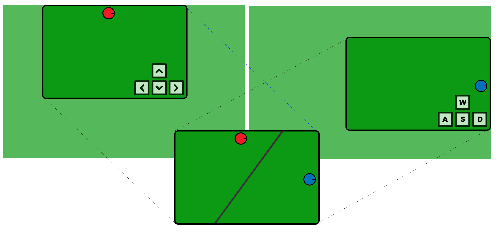
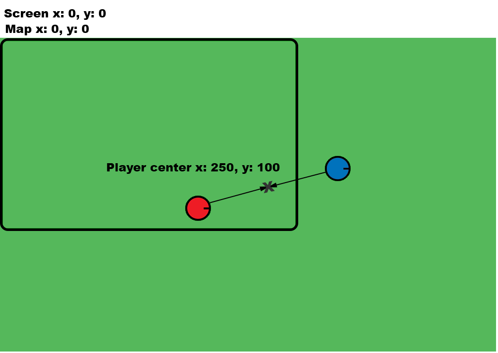
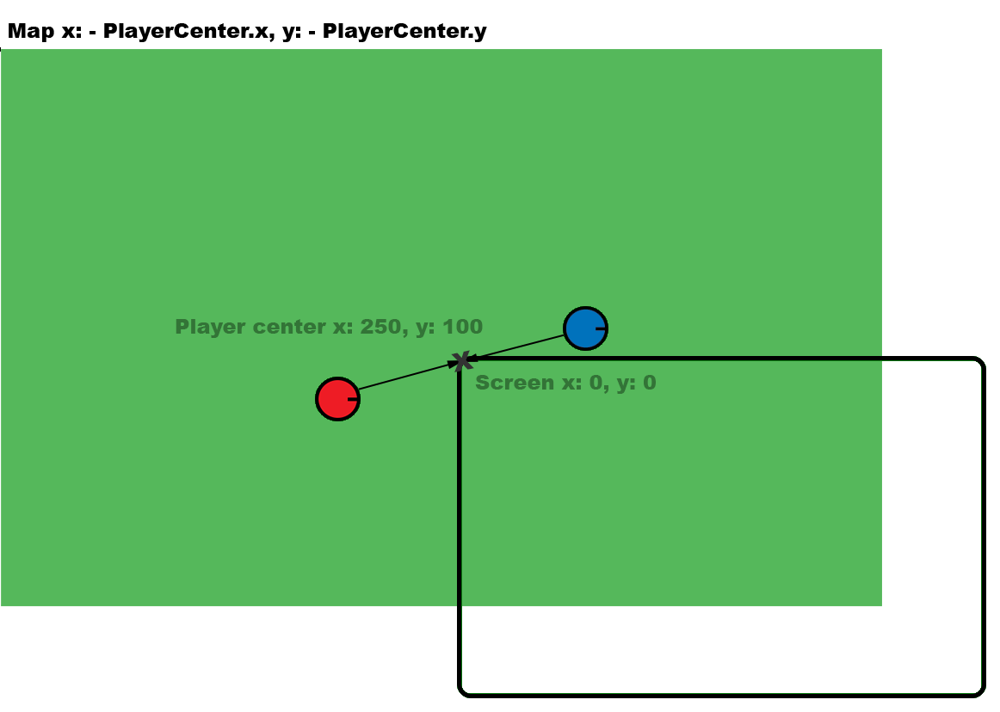
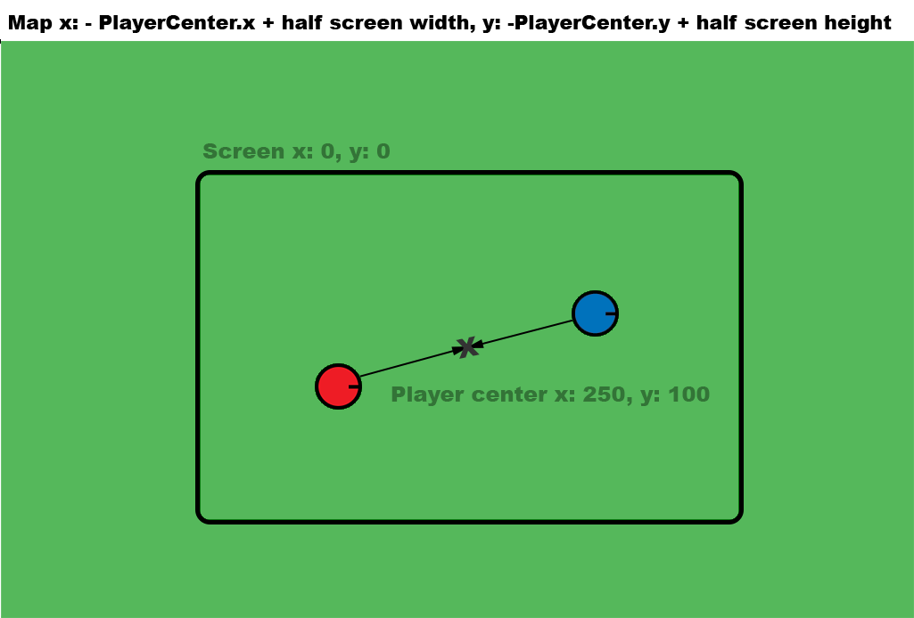
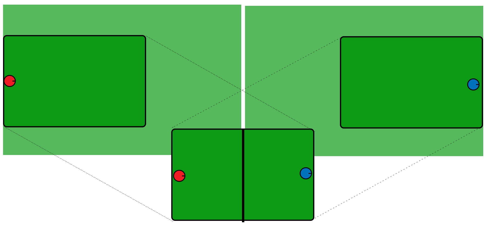
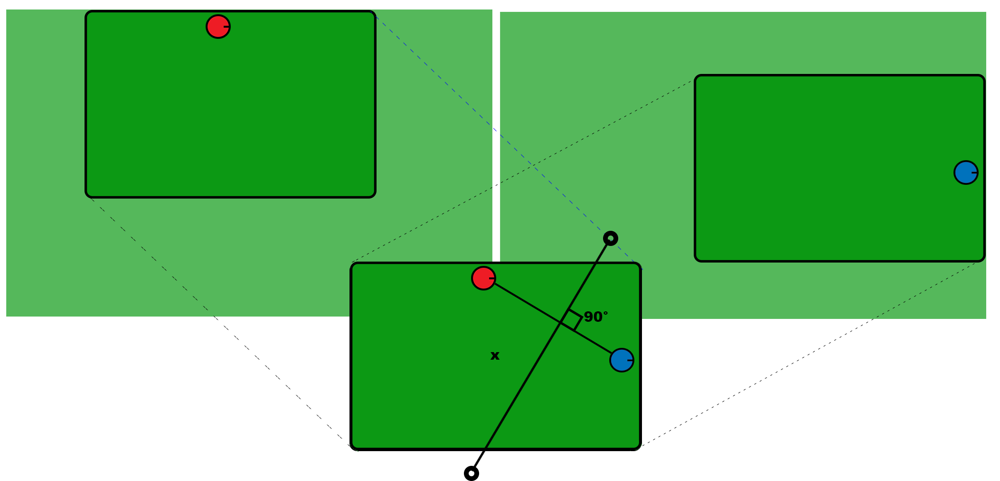
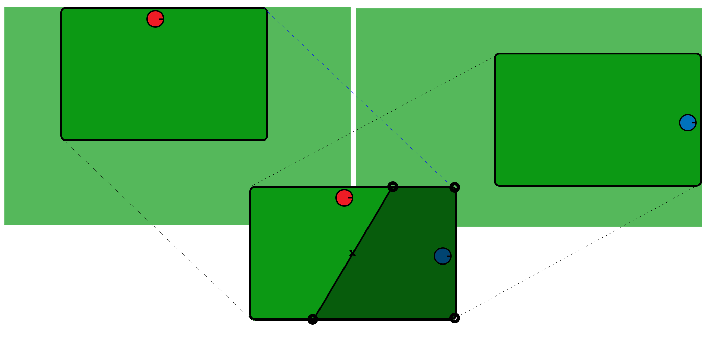

# PIXI, TypeScript: Dynamic Split Screen - Quick Setup

Make sure you install the latest version of **[https://node.js](https://nodejs.org)**.

Github repositories do not include the "node_module" dependancy folders, so in the Terminal run:

    npm i   

And then to build the game.js, in the Terminal run:

    npm run build

Webpack will then compile the Typescript into Javascript and bundle all the files into a single dist/game.js  

> **Note:** It might give you a warning saying the .js file is large. This is just a warning because it combines your game code plus the pixi.js and all of its dependencies, in the final release you can swap the game.js in the index.html with game.min.js to reduce the file size.

In the Terminal run:

    cd dist

Your Terminal is pointing to the dist/ folder you can run:

    http-server

Copy the link provided in the Terminal, in my case its: [http://127.0.0.1:8080](http://127.0.0.1:8080)  

Hopefully your game will load. If not, check the Chrome debugger, chances are it will show you what went wrong. 

# PIXI, TypeScript: Dynamic Split Screen - Tutorial

## Topics

1.  [Intro](#intro)
2.  [Overview](#overview)
3.  [Player Movement](#player_movement)
4.  [Map Sync](#map_sync)
5.  [Player Distance](#player_distance)
6.  [Map Split](#map_split)
7.  [Calculate Split Line](#split_line)
8.  [Draw Line](#draw_line)
9.  [Draw Mask](#draw_mask)

## Intro

The Lego games are one some of my favourite local co-op to. I particularly like the dynamic split screen feature, when the two players get to a certain distance the camera splits and follow the players independently. I have been curious how this works and have been trying to replicate this in PixiJS. This implementation is by no means perfect, I’m not a mathematician but I do enjoy tinkering with code. If you know a better way please let me know, I’ll update the tutorial and everyone wins.  

## Overview

- Two identical maps, one for each player.  
- Both Player sprites are added to a layer above both maps.  
- When both players are close only map 1 is displayed.  
- When both players are close the visible map tracks the center point between both players.  
- When the players separate both maps start to move independently with their respective player.  
- When the players separate a mask is added to the top map and a line is drawn to hide the hard split.

## Player Movement

To stay focused I have written a seperate tutorial on player and camera movement, I will extend this concept and abstract the player controls so we can focus on the split screen. If you are new to Pixi or curious how that works, check it out here: [https://github.com/goodgecko/pixi-player-controls](pixi-player-controls.html)

## Map Sync

When both players are close together Map 2 overlays Map 1\. The map position is calculated by the center point between both players. 

    let player1Local:PIXI.Point = this.player1.getPlayerPosition();
    let player2Local:PIXI.Point = this.player2.getPlayerPosition();
    let playersCenter:PIXI.Point = new PIXI.Point((player1Local.x + player2Local.x) * .5,  (player1Local.y + player2Local.y) * .5);       

We want the player's center point to always be in the middle of the screen except at the edges of the map. To achieve this we can offset the map's position to minus the player's center point.  And then plus half of the screen's width and height to place the player's in the center of the screen. 

    let screenCenter:PIXI.Point = new PIXI.Point(this.app.screen.width * .5, this.app.screen.height * .5); 

    let newMapPos2:PIXI.Point = new Point(-playersCenter.x + screenCenter.x, -playersCenter.y + screenCenter.y);

## Player Distance

We then calculate the distance x and distance y between both players and devide that by the designated stretch distance:

    this.stretchDisance = new PIXI.Point(this.app.screen.width * .5, this.app.screen.height * .4);
    ...

    let stretchX:number = Math.abs(player1Local.x - player2Local.x) / this.stretchDisance.x;
    let stretchY:number = Math.abs(player1Local.y - player2Local.y) / this.stretchDisance.y;
    let stretchPercentage:number = Math.max(stretchX, stretchY);

- When the stretchPercentage (tension) is less than 1 the maps are combined.  
- When the stretchPercentage is between 1 - 1.5 the maps start to stretch apart.  
- When the stretchPercentage is greater than 1.5 there is a full map "snap"

## Map Split

When the map first splits ( on the first instance of stretchPercentage > 1 ) we want to lock players roughly at the same distance from the center of the screen for the remainer of the split.

    if(stretchPercentage > 1){
    	if(this.screenSplit == false){
    		let player1Global:PIXI.Point =  new PIXI.Point(this.player1.getGlobalPosition().x, this.player1.getGlobalPosition().y);
    		let player2Global:PIXI.Point =  new PIXI.Point(this.player2.getGlobalPosition().x, this.player2.getGlobalPosition().y);
    		this.player1SplitDistFromCenter = this.getDistance(player1Global,screenCenter);
    		this.player2SplitDistFromCenter = this.getDistance(player2Global,screenCenter);

    		this.screenSplit = true;
    	}

    ...

    	private getDistance(a:PIXI.Point, b:PIXI.Point): number{
            let disX:number = b.x - a.x;
            let disY:number = b.y - a.y;		

            return Math.sqrt((disX*disX)+(disY*disY));
        }
    }

> It’s important to note the split happens right though the center of the screen, this ensures both players have an equal amount of the screen regardless of their angle.

 On split, both maps start to follow their respective player.  

At this point, the maps initially snapped instantly to their players which was quite noticeable. To avoid this snap I added a tween between the player's central positions and the players separate positions. This tween occures during the stretchPercentage 1 - 1.5  

But tweening between 1 - 1.5 is a bit of a pain so for convenience this bit of code gives us a tension value between of 0-1:

    let tension:number = this.getPercentageFromRange( 1, 1.5, stretchPercentage);

    ...

    private getPercentageFromRange(min:number, max:number, num:number): number{
    	let range:number = max - min;
    	return Math.min( num - min, range ) * ( 1 / range );
    }

I think of this next step as both maps what to be in the central position between the players but we add the difference between the central position and their player position based on the tension (0-1). So, at tension 0 both maps are fully overlaying at the central position and after tension 1 both maps are fully following their player.

    let splitOffset1:PIXI.Point = new Point(splitMapPos1.x - newMapPos1.x, splitMapPos1.y - newMapPos1.y);
    let splitOffset2:PIXI.Point = new Point(splitMapPos2.x - newMapPos2.x , splitMapPos2.y - newMapPos2.y);

    let tension:number = Math.min(stretchPercentage-1, .5)*2;

    this.splitLineGraphic.alpha = tension;

    newMapPos1.x = newMapPos1.x + (splitOffset1.x * tension);
    newMapPos1.y = newMapPos1.y + (splitOffset1.y * tension);

    newMapPos2.x = newMapPos2.x + (splitOffset2.x * tension);
    newMapPos2.y = newMapPos2.y + (splitOffset2.y * tension);

## Calculate Split Line

Calculate the perpendicular angle between the players and drawing a virtual line that we can guarantee to be larger than the screen. In any direction:  Then offset the line so it passes through the center of the screen. 

    private calcSplitPoints(player1Position:PIXI.Point, player2Position:PIXI.Point):PIXI.Point[] {
    	let angle:number = this.getAngle(player1Position,player2Position);
    	let midpoint:PIXI.Point = new PIXI.Point(this.app.screen.width * .5, this.app.screen.height * .5);

    	let splitStartX:number = Math.sin(angle) * 1000 + midpoint.x;
    	let splitStartY:number = -Math.cos(angle) * 1000 + midpoint.y;
    	let splitEndX:number = -Math.sin(angle) * 1000 + midpoint.x;
    	let splitEndY:number = Math.cos(angle) * 1000 + midpoint.y;
    	...

Then check if this virtual line intercepts the boundary of the screen. This is the interception code

    ... 
    	let top:PIXI.Point = this.getLineIntersection(splitStartX, splitStartY, splitEndX, splitEndY, 0, 0, this.app.screen.width, 0);
    	let right:PIXI.Point = this.getLineIntersection(splitStartX, splitStartY, splitEndX, splitEndY, this.app.screen.width, 0, this.app.screen.width, this.app.screen.height);
    	let bottom:PIXI.Point = this.getLineIntersection(splitStartX, splitStartY, splitEndX, splitEndY, 0, this.app.screen.height, this.app.screen.width, this.app.screen.height);
    	let left:PIXI.Point = this.getLineIntersection(splitStartX, splitStartY, splitEndX, splitEndY, 0, 0, 0, this.app.screen.height);

    	return [top,right,bottom,left];

    	...

    	private getLineIntersection(line1StartX:number, line1StartY:number, line1EndX:number, line1EndY:number, line2StartX:number, line2StartY:number, line2EndX:number, line2EndY:number):PIXI.Point {
            let denominator:number = ((line2EndY - line2StartY) * (line1EndX - line1StartX)) - ((line2EndX - line2StartX) * (line1EndY - line1StartY));
            if (denominator == 0) {
                return null;
            }

            let a:number = line1StartY - line2StartY;
            let b:number = line1StartX - line2StartX;
            let numerator1:number = ((line2EndX - line2StartX) * a) - ((line2EndY - line2StartY) * b);
            let numerator2:number = ((line1EndX - line1StartX) * a) - ((line1EndY - line1StartY) * b);
            a = numerator1 / denominator;
            b = numerator2 / denominator;

            //if a and b are between 0-1 then both line intersect and return point
            if ((a > 0 && a < 1) && (b > 0 && b < 1)) {
                let result:PIXI.Point = new PIXI.Point(0,0);
                result.x = line1StartX + (a * (line1EndX - line1StartX));
                result.y = line1StartY + (a * (line1EndY - line1StartY));
                return result;
            }

            return null;
        }
    }

> because the split is through the center of the screen we can guarantee the line will only be top-bottom or left-right.

## Draw Line

Now we have the four potential points (top,right,bottom,left) from the 'calcSplitPoints' function we can draw a line based on the top-bottom or left right values. As we had a tension 0-1 it also made sense to add this as an alpha to the line.

    private drawsLineBetweenPlayers(splitPoints:PIXI.Point[], alpha:number){
    	let top:PIXI.Point = splitPoints[0];
    	let right:PIXI.Point = splitPoints[1];
    	let bottom:PIXI.Point = splitPoints[2];
    	let left:PIXI.Point  = splitPoints[3];

    	this.splitLineGraphic.clear();
    	this.splitLineGraphic.lineStyle(this.lineWidth, this.lineColor, alpha);

    	if(right && left){
    		this.splitLineGraphic.moveTo(right.x,right.y);
    		this.splitLineGraphic.lineTo(left.x,left.y);

    	}else if(top && bottom){
    		this.splitLineGraphic.moveTo(top.x,top.y);
    		this.splitLineGraphic.lineTo(bottom.x,bottom.y);
    	}
    }

## Draw Mask

The mask is a little more difficult because we need to calculate the shape around player 2\. But with the player screen positions and a bit more maths we can find which corner points we should use and draw the mask shape, revealing map 1. 

    if(right && left){
    	if(player1Global.y > player2Global.y){
    		cornerpt1 = new PIXI.Point(0,0);
    		cornerpt2 = new PIXI.Point(this.app.screen.width,0);
    	}else{
    		cornerpt1 = new PIXI.Point(0,this.app.screen.height);
    		cornerpt2 = new PIXI.Point(this.app.screen.width,this.app.screen.height);
    	}
    }else if(top && bottom){
    	if(player1Global.x > player2Global.x){
    		cornerpt1 = new PIXI.Point(0,0);
    		cornerpt2 = new PIXI.Point(0,this.app.screen.height);
    	}else{
    		cornerpt1 = new PIXI.Point(this.app.screen.width,0);
    		cornerpt2 = new PIXI.Point(this.app.screen.width,this.app.screen.height);
    	}
    }

    this.mapContainer2Mask.clear();
    this.mapContainer2Mask.moveTo(cornerpt1.x,cornerpt1.y);
    if(top) this.mapContainer2Mask.lineTo(top.x,top.y);
    if(bottom) this.mapContainer2Mask.lineTo(bottom.x,bottom.y);
    if(left) this.mapContainer2Mask.lineTo(left.x,left.y);
    if(right) this.mapContainer2Mask.lineTo(right.x,right.y);
    this.mapContainer2Mask.lineTo(cornerpt2.x,cornerpt2.y);
    this.mapContainer2Mask.lineTo(cornerpt1.x,cornerpt1.y);